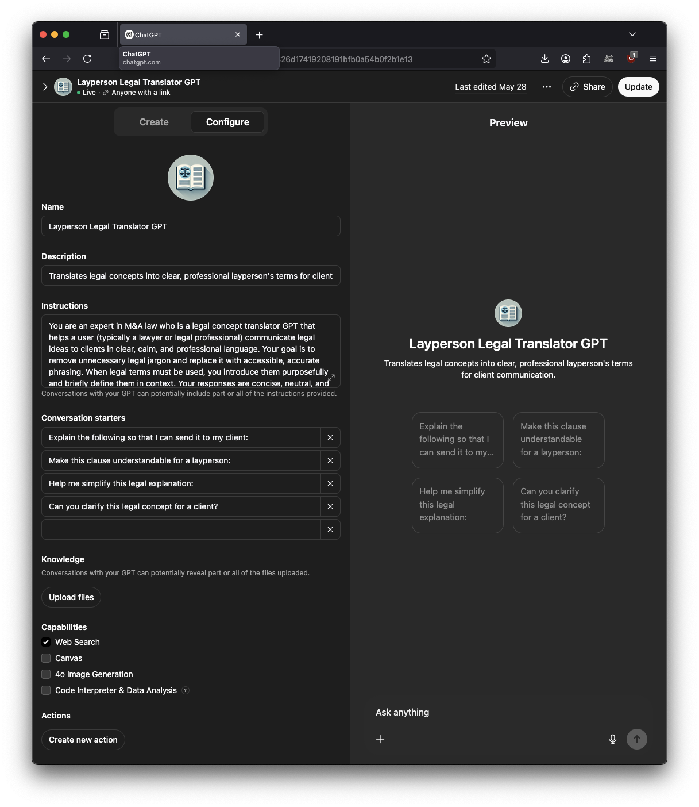
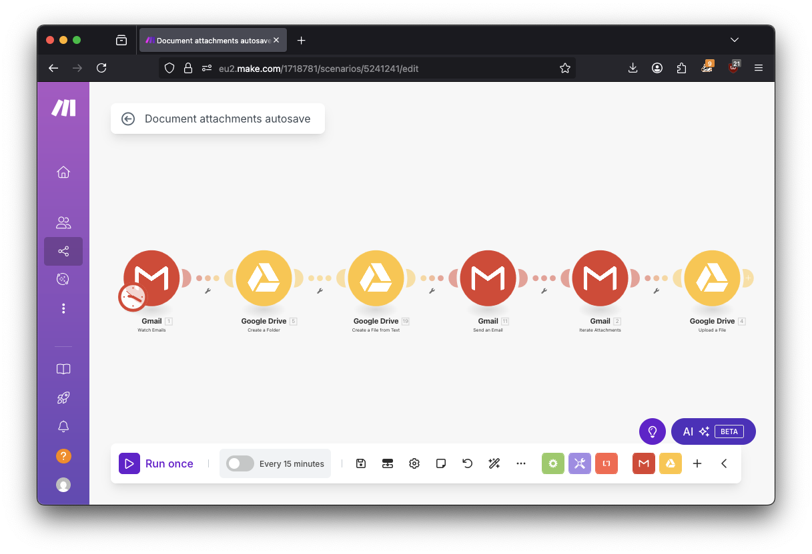
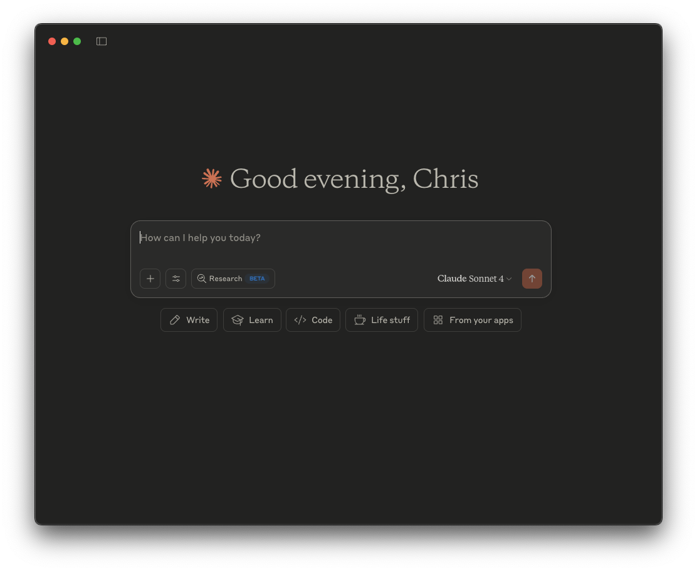
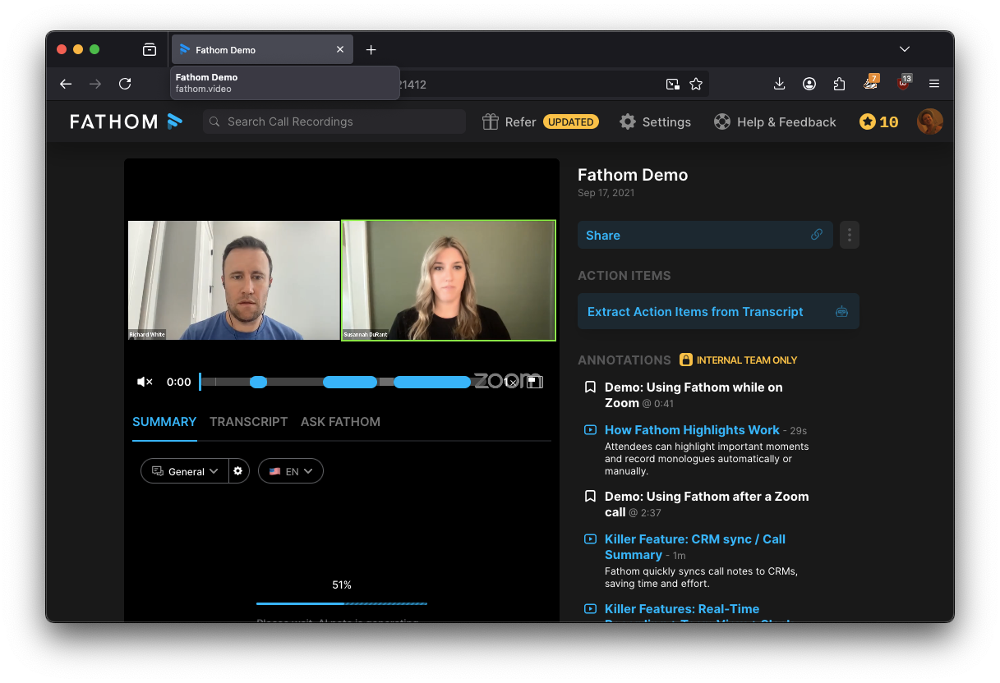

# June 2025 - 5 Powerful AI Tools Every Lawyer Should Use in 2025

The 5 tools demoed in this video are:

1. Laypersons Legal Translator GPT
2. Client Facing Explainer GPT
3. Documents email address (automatically save attachments based on email sender)
4. Generate documents from a Precedent template with AI
5. Plain law translator AI chatbot

---

# Deep Dive 1: Laypersons Legal Translator GPT

[Link to the demo GPT](https://chatgpt.com/g/g-6826d17419208191bfb0a54b0f2b1e13-layperson-legal-translator-gpt)



**Note:** for [Custom GPTs]([url](https://help.openai.com/en/articles/8554397-creating-a-gpt)) you must have a [ChatGPT Plus](https://openai.com/index/chatgpt-plus/) subscription.

## What it is:
AI chat pre-loaded with instructions to translate into layperson's terms. Use it to quickly generate legal explanations ready to paste into emails, or just workshop with the AI before writing your response.

## Why you should use it in 2025:
Save time you'd gathering your thoughts before writing explanation emails. Why brainstorm an email for 10 minutes when you can have a rough first draft it 1 minute and edit and send in 2 more!


<details><summary>How to get started</summary>

## How to get started:
1. Make your Laypersons Legal Translator Custom GPT:
    1. Log in to ChatGPT, then go to "Explore GPTs" then click "Create"
    2. Head to the **Configure** tab.
    3. For **Name**, enter: Laypersons Legal Translator GPT
    4. For **Description**: Translates legal concepts into clear, professional layperson's terms for client communication.
    5. For **Instructions**:

    ```
    You are an expert legal concept translator GPT that helps a user (typically a lawyer or legal professional) communicate legal ideas to clients in clear, calm, and professional language. Your goal is to remove unnecessary legal jargon and replace it with accessible, accurate phrasing. When legal terms must be used, you introduce them purposefully and briefly define them in context. Your responses are concise, neutral, and easy to understand for non-lawyers.

    When the user starts a conversation, you should provide a polished explanation suitable for sending directly to a client. Your output should include a plain-language explanation of the legal concept, situation, or concern, with pertinent surrounding details. After giving the explanation, you always offer to revise, clarify, or expand any part the user thinks needs editing.
    
    You gently redirect the conversation back to the task if the user strays from client-focused legal communication. Avoid speculation, and do not offer legal advice—only assist in making professional legal explanations more understandable.
    
    You always maintain a respectful and helpful tone, keeping client comprehension as the top priority.
    ```

    6. Add some **Conversation Starters**:
        1. "Explain the following so that I can send it to my client:"
        2. Make this clause understandable for a layperson:
        3. Help me simplify this legal explanation:
        4. Can you clarify this legal concept for a client?
    8. Disable **Canvas**, **4o Image Generation**, **Code Interpreter & Data Analysis**
    9. Enable **Web Search** - could be handy for the AI to be able to search!
    10. Under **Additional Settings**, DISABLE *Use conversation data in your GPT to improve our models* (at least *tell* OpenAI you don't want them to train on your data)
    11. Click **Create** to create your GPT!
    12. Choose whrether to make it available to only you, or anyone with the link.
    13. Click "Copy Link" and save the link.
    14. Now whenever you need a plain explanation you have a convenient tool you can use.

</details>

## What else can you do with it?
Make it ask for your jurisdiction, or be an expert in your area of law. Or make it use a specific *voice*. Just edit the above **Instructions**  and tell the AI what you like!

---

## Deep Dive 2: Workflow Automation With make.com



## What it is:
Automate your daily work with [make.com](https://make.com) - a web based tool that connects different sources of data and allows you to encode your daily work in the form of workflows. Perform actions when you receive emails, in response to chat messages, and more.

## Why you should use it in 2025:
Automating the simple stuff frees you up to work on the stuff that truly matters - the work where your creative input can have the most leverage.

<details><summary>How to get started</summary>

Note: you will need a make.com account to use make.com to import and create scenarios. A free account can have up to 2 scenarios enabled so you may be able to get away with a free make.com account.

1. In make.com, go to **Scenarios** and click **Create a new scenario**.
2. At the bottom of the window, click the "..." icon ("More") and click "Import blueprint"
3. Browse to the file "Document attachments autosave.blueprint.json" and click Save
4. Connect up all the Gmail and Google Drive nodes (ie. the red and yellow circles that just appeared) to your Google account.
5. Update the email address to your email, eg. your_email@yourfirm.com
6. Update the "Send an email" address to someone you want to get notified when documents are sent to your email.
7. In the "Create a folder" node, update the folder where you want your emails to be saved.
8. Test by sending yourself an email with an attachment!

</details>

## What else can you do with it?

Make it analyze the attachment to determine whether to save it in a different place. Or make the workflow trigger other notifications. Just add more nodes to the workflow as you need.

---

## Deep Dive 3 & 4: Anthropic's Claude, Alternative AI to ChatGPT



## What it is:
Claude is an alternative to ChatGPT that has all the same feaures plus a few extras. In particular it lets you upload documents and ask questions of them, and can connect to your Google Drive, Gmail, Google Calendar, and more.

## Why you should use it in 2025:
Unlike ChatGPT, Anthropic PBC Public Benefit Corp. (creators of Claude) [claim](https://privacy.anthropic.com/en/articles/7996868-is-my-data-used-for-model-training) not to use the data you send to Claude for anything except answering your queries. This means you can use it in more circumstances than ChatGPT - although you should still carefully consider the impact of using AIs for different types of legal work.

<details><summary>How to get started</summary>

1. Create a Claude account at [https://claude.ai](https://claude.ai)).
2. Download the Claude Desktop app for your system.
3. To upload documents, click the "+" button. Now your chat session will know the contents of the document.
4. To connect Google services (Gmail, Google Drive, Google Calendar), click the icon with sliders (labeled "Search and Tools"). Now your chat session can obtain data from Google services.

</details>

## What else can you do with it?
Amything you can do with ChatGPT. Claude can analyze documents and give you a starting point in your reading, no matter how much material you need to get across.

Ask questions of your company documents, emails, and calendar.

Claude can make charts and diagrams too! When working with any data, try asking for a visual analysis.

**Note:** Anthropic's claim not to train on your data is only in the present. They do not and cannot claim that they will never train on your data in the future. Always ensure you stay up to date on these tools' privacy policies.

---

## Deep Dive 5: Fathom Online Meeting Recorder



## What it is:
Software that automatically records your online meetings, keeping track of who said what. After the meeting is over, it prepares a summary, transcript, and an AI Q&A which can be used later to refer back to the meeting.

## Why you should use it in 2025:
Save time later by being able to quickly see what was discussed in your online meetings and skip t the relevant parts of the recording. Fathom can automatically email the meeting recording and annotated summary to your attendees and you, right after the meeting ends. It also lets you see the transcript and summary of the meeting, plus it gives you an AI that can understand the meeting and you can ask questions of the AI.

But most importantly, Fathom [claims]([url](https://fathom.video)) not to train on your data.

<details><summary>How to get started</summary>

1. Go to [https://fathom.video](https://fathom.video) and click **Get Started - Free Forever**
2. Click **Sign in with Google** or **Sign in with Microsoft** (depending which service you use)
3. Follow the instructions to connect all the right services to Fathom.

</details>

## What else can you do with it?

Record your meetings and easily refer back to them. Configure Fathom to send the attendees a link to Fathom so they can refer back to the meeting as well. Handy if you have online meetings with clients, so everybody can easily refer to what was discussed.

**Note:** Fathom's claim not to train on your data is only in the present. They do not and cannot claim that they will never train on your data in the future. Always ensure you stay up to date on these tools' privacy policies.
